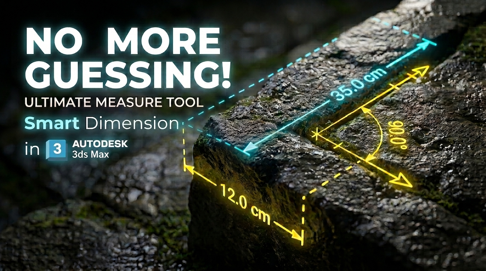

# Smart Dimension for 3ds Max

  <h3>Click the image above to watch the full tutorial on YouTube</h3>

---

A comprehensive, interactive, and high-precision measurement suite for Autodesk 3ds Max. **Smart Dimension** streamlines architectural and 3D modeling workflows by offering real-time viewport dimensioning, automatic bounding boxes, inter-object distance analysis, angle measurement, and surface area calculations[cite: 1].

## Features
- **Auto Bounding Box:** Generates instant 3D dimension lines across X, Y, and Z axes for selected geometry with a single click[cite: 1].
- **2-Point Distance Measure:** Interactive point-to-point measurement with live 3D snapping, text offsets, and clipboard copy support[cite: 1].
- **Smart Objects Distance:** Automatically computes the closest surface-to-surface or axis-aligned distances between 2 or more objects[cite: 1].
- **Angle Measurement:** Supports single (3-point) and continuous multi-vertex angle calculation with interactive viewport degree displays[cite: 1].
- **Area & Perimeter Tool:** Calculates 3D surface area and polygon perimeter with live vertex picking and normal alignment[cite: 1].
- **Interactive UI & Customization:** Fully dockable sidebar with real-time controls for marker types (Open Arrow, Solid Circle, Filled Triangle), text sizes, line colors, and unit conversions (mm, cm, m, in, ft)[cite: 1].
- **Undo/Redo & Viewport Redraw Support:** Fully compatible with 3ds Max Undo stack and active viewport navigation[cite: 1].

## Installation
1. Download the [MRT_SmartDimension_v1.0.zip](https://github.com/mrtvisual/Smart-Dimension-for-3Ds-max/raw/main/MRT_SmartDimension_v1.0.zip) file.
2. Extract the archive and **drag and drop** the `.mcr` file directly into your 3ds Max viewport[cite: 1].
3. Go to **Customize > Customize User Interface > Toolbars** tab[cite: 1].
4. Under the `mrtTools` category, drag **"Smart Dimension"** onto your desired toolbar[cite: 1].

## Usage
- Open **Smart Dimension** from your toolbar[cite: 1].
- **Quick Access Bar:** Use one-click shortcuts to trigger common workflows (Auto Dimension, Length, Objects Distance, Angle, or Area)[cite: 1].
- **Auto Dimension:** Select one or multiple objects and click **"Bounding Box"** to generate 3D dimensions[cite: 1].
- **Measure Distance / Angle:** Click the measure toggle and use 3D viewport snaps to pick points[cite: 1].
- **Live Tweaks:** Adjust text scale, marker style, offset distance, and color dynamically while elements are selected[cite: 1].
- **Docking:** Use the `<` and `>` buttons at the top to dock the interface to the left or right side of your 3ds Max viewport[cite: 1].

## Support
If you have any questions, bug reports, or feature requests, feel free to open an issue in this repository.

---
*Created by Mohammad Reza Taheri*[cite: 1]
